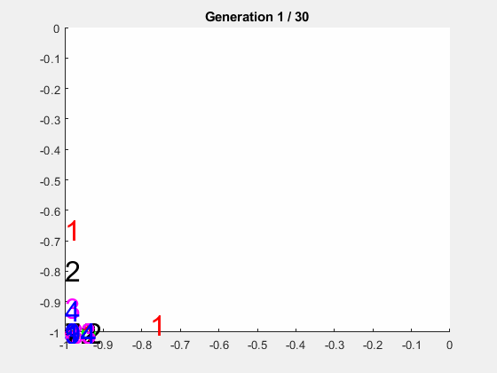

This repository contains Matlab and Python class libraries and example code for a few kinds of evolutionary (genetic) 
algorithm:

1. The [Standard Genetic Algorithm](https://mitpress.mit.edu/books/introduction-genetic-algorithms) (Matlab)

2. The [NSGA-II](http://www.iitk.ac.in/kangal/Deb_NSGA-II.pdf) algorithm for multi-objective optimization (Matlab, Python)

3. [Random-Mutation Hill-Climbing](http://www.cleveralgorithms.com/nature-inspired/stochastic/hill_climbing_search.html), to use as a baseline for comparison (Matlab)

4. A &ldquo;homebrew&rdquo; Multi-Objective Optimization algorithm that I developed before learning about
NSGA-II (Matlab)

5. An elitist GA that keeps the best individual in the population and uses only mutation (Python)

The library supports parallel fitness evaluation (on multi-core or cluster machines).

## Matlab Quickstart

1. Add SUEAP/matlab to your Matlab path (<b>Home / Set Path / Add with Subfolders ...</b>).

2. In the Matlab interpreter, run ```fon(@nsga2p, 100, 30, .7, .01)```.  This should produce a sequence of figures as
in the animation above, based on the fitness function from
[Fonseca and Fleming (1993)](http://citeseerx.ist.psu.edu/viewdoc/download?doi=10.1.1.48.9077&rep=rep1&type=pdf).

## Matlab Parallel fitness evaluation

To try out parallel fitness evaluation, you should first download, install, and test the
[PECON](https://github.com/simondlevy/PECON) repository.  Then take a look at the 
[testm](https://raw.githubusercontent.com/simondlevy/SUEAP/master/matlab/examples/slowfit/testm.m) script to see 
how to run fitness evaluation in parallel.

## Python Quickstart

```
cd python/nsga2
python3 fon.py
```

This will show you the performance of NSGA-II on the fitness function from
[Fonseca and Fleming (1993)](http://citeseerx.ist.psu.edu/viewdoc/download?doi=10.1.1.48.9077&rep=rep1&type=pdf).

To install sueap for use in other projects:

```
sudo python3 setup.py install
```

## Python notes

You can get better performance by using a population size that is a multiple of
the number of workers (processors, cores, CPUs) available to you.  For example,
if you have 128 workers, use a population of 2048 instead of 2000.

## Working with OpenAI Gym

The class [sueap.gym.Problem](https://github.com/simondlevy/SUEAP/blob/master/python/sueap/gym/__init__.py)
is an abstract class that you can use to apply genetic algorithms
to solving problems (environments) using the [OpenAI Gym](https://gym.openai.com/ framework).  Your
subclass should implement a method ```get_action(self, params, observation)``` that returns the appropriate
action.

## Citing SUEAP

```
@InProceedings{SUEAP2005,
    title     = {Cheap and Easy Parallelism for Matlab on Linux Clusters},
    year      = {2005},
    author    = {Levy, S.D. and Djalaliev, P. and Shrestha, J.M. and Khasymski, A. 
                 and Connors, C.},
    booktitle = {Proceedings of the 18th International Conference on Parallel 
                 and Distributed Computing Systems},
    publisher = { International Society for Computers and their Applications},
    address   = {Las Vegas, Nevada}
}
```
